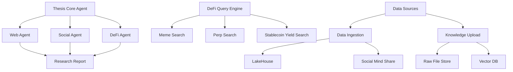

# Thesis.io Context Engineering: Affordable AI-native for DeFi at Scale

Thesis.io serves thousands of users daily with unlimited web search capabilities and a premium plan at just $20/month that includes 40 deep research sessions. This document explores the technical architecture and optimization techniques that make this affordable scaling possible.

## Service Model and Pricing Strategy

### User Base and Offerings

Thesis.io operates at significant scale while maintaining affordability:

- **Thousands of daily active users** across the platform
- **Unlimited web search** and follow-ups for all users
- **Premium plan**: $20/month including:
  - 40 deep research sessions
  - Unlimited follow-ups in private spaces
  - Advanced DeFi analysis capabilities

### The Scaling Challenge

The fundamental challenge lies in providing high-quality AI-powered DeFi research while keeping costs manageable. State-of-the-art (SOTA) language models are expensive:

| Model | Provider | API Cost (per 1M tokens) | Subscription |
|-------|----------|---------------------------|--------------|
| Claude 4 Sonnet | Anthropic | $3/$15 (input/output) | Pro: $20/mo |
| OpenAI o3 | OpenAI | $10/$40 | Pro: $200/mo (est.) |
| GPT-5 | OpenAI | $1.25/$10 | Pro: $200/mo |
| Gemini 2.5 | Google | $3.5/$10 | Advanced: ~$20/mo |

<Warning>
Without optimization, operations previously cost about $300 per day with an average of 600k tokens per session, making scaling to millions of users unsustainable.
</Warning>

## Technical Architecture: Context Engineering

### What is Context Engineering?

Context engineering is the core technique for optimizing Large Language Model (LLM) costs without compromising quality. It involves managing the context window of LLMs to produce desired answers for user requests.

**Key Principle**: Filling the right information in the right format so the LLM can complete the task effectively.

### Context Window Structure

A typical Thesis.io context window contains structured elements that flow through the system:

```json
{
  "context_elements": [
    {
      "type": "system",
      "content": "List tool descriptions and system prompt",
      "color": "pink"
    },
    {
      "type": "user", 
      "content": "Initial user prompt: 'Analyze crypto news today'",
      "color": "green"
    },
    {
      "type": "assistant",
      "content": "I should fetch today's crypto news from major sources...",
      "color": "yellow"
    },
    {
      "type": "tool_call",
      "function": "web_search()",
      "parameters": {"query": "crypto news today"},
      "color": "blue"
    },
    {
      "type": "tool_result",
      "content": "Web search results...",
      "color": "blue"
    },
    {
      "type": "assistant",
      "content": "Reasoning and analysis message",
      "color": "yellow"
    },
    {
      "type": "user",
      "content": "Follow-up: 'Why is my bag down??????'",
      "color": "green"
    }
  ]
}
```

<Info>
The context window acts as a structured array of strings that provides the LLM with all necessary information to generate accurate, contextual responses. Each element is categorized and flows through the Thesis LLM processing pipeline.
</Info>

## Three Key Optimization Techniques

<Warning>
**Before Optimization**: $300/day operational costs with 600k tokens/session
</Warning>

<Tip>
The optimization achieved a 6-7x cost reduction while maintaining user satisfaction and response times
</Tip>

### 1. Prompt KV Caching (5x Cost Reduction)

Prompt KV (Key-Value) Caching is Anthropic's mechanism that saves compute power by caching prefixed tokens, reducing operational costs by **5x** for long-running tasks. Below is an example of Anthropic's Prompt Caching that we leverage to reduce costs.

#### How Anthropic's Prompt Caching Works

<Tabs>
  <Tab title="Basic Implementation">
    ```bash
    curl https://api.anthropic.com/v1/messages \
      -d '{
        "model": "claude-opus-4-1-20250805",
        "system": [
          {
            "type": "text",
            "text": "You are an expert DeFi analyst. Analyze the following protocols...",
            "cache_control": {"type": "ephemeral"}
          }
        ],
        "messages": [
          {
            "role": "user",
            "content": "Analyze today's yield farming opportunities"
          }
        ]
      }'
    ```
  </Tab>
  <Tab title="Advanced Caching">
    ```bash
    curl https://api.anthropic.com/v1/messages \
      -d '{
        "model": "claude-opus-4-1-20250805",
        "system": [
          {
            "type": "text", 
            "text": "System instructions for DeFi analysis...",
            "cache_control": {"type": "ephemeral"}
          }
        ],
        "tools": [
          {
            "name": "web_search",
            "description": "Search for current DeFi information",
            "input_schema": {...},
            "cache_control": {"type": "ephemeral"}
          }
        ]
      }'
    ```
  </Tab>
</Tabs>

#### Visual Cache Performance

| Cache Status | Computation | Cost Impact | Visual Indicator |
|--------------|-------------|-------------|-----------------|
| **Cache Hit** ✅ | Most tokens reused | 80-90% savings | 🟢🟢🟢🟠 |
| **Cache Miss** ❌ | All tokens computed | Full cost | 🟠🟠🟠🟠 |
| **Partial Hit** ⚡ | Mixed reuse | 40-60% savings | 🟢🟢🟠🟠 |

<Tip>
For long DeFi research sessions, caching tool definitions and system instructions can reduce costs by 5x while maintaining response quality.
</Tip>

### 2. Divide-and-Conquer with Sub-Agents

This approach transforms complex DeFi research into specialized tasks, distributing work across dedicated agents that operate in parallel without maintaining expensive long contexts.

#### AI Research Engine Architecture



#### Benefits

- **Reduced Context Length**: Sub-agents operate with focused, task-specific contexts
- **Parallel Processing**: Multiple agents work simultaneously on different aspects 
- **Specialized Expertise**: Each agent optimized for specific DeFi domains
- **Cost Efficiency**: Main agent avoids including intermediate processing in context
- **Scalability**: Easy to add new specialized agents without affecting existing ones

### 3. Self-Hosted Models (2-3x Cheaper and Faster)

Self-hosting smaller and open-source models to handle specialized DeFi tasks dramatically reduces dependency on expensive SOTA LLMs while improving domain-specific performance.

## Future Outlook for AI in DeFi

### Next Generation LLMs

The upcoming generation of language models promises to:

- **Further reduce costs** through improved efficiency architectures
- **Enable mass adoption** of AI in DeFi applications
- **Provide better performance** at significantly lower price points
- **Democratize access** to sophisticated DeFi analysis tools

The result proves that advanced AI can be democratized through intelligent engineering, making sophisticated DeFi analysis accessible to thousands of users while maintaining sustainable economics for continued innovation and growth.

<Card title="Ready to build with Thesis.io?" icon="rocket">
Explore our [API Reference](../api-reference/conversations/create-new-conversation) to start building cost-effective AI-powered DeFi applications using these proven optimization techniques.
</Card>